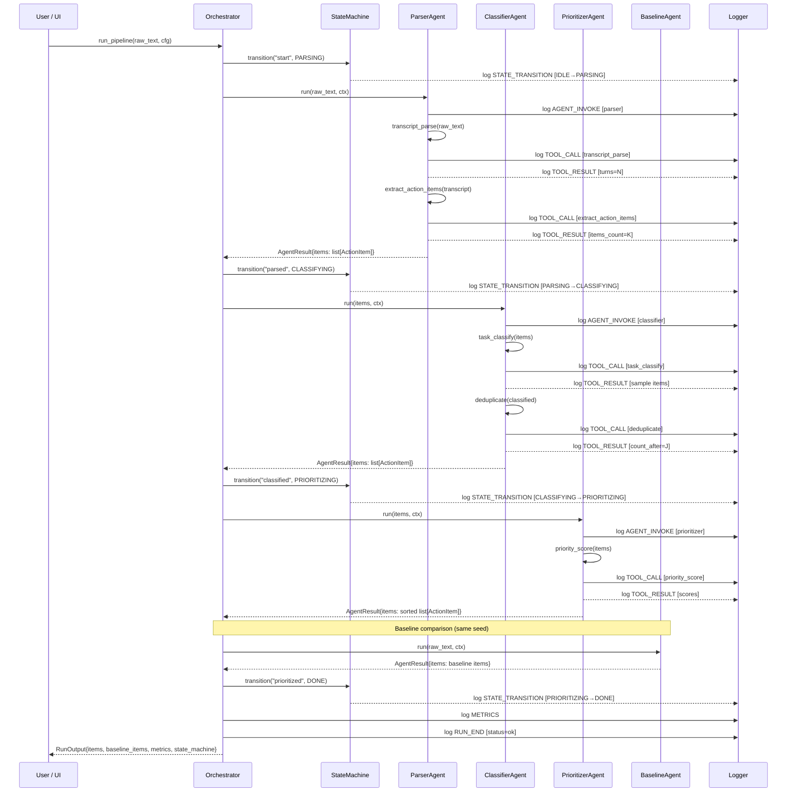

# Agent Interaction Diagram
## Meeting Notes → Action Items Extractor

### Sequence Diagram



---

### Message Protocol (JSON)

All inter-agent communication uses structured `AgentResult` objects:

```json
{
  "message": "Parsed 5 turns and extracted 3 candidate action items.",
  "data": {
    "items": [
      {
        "id": "T001",
        "title": "@Bob please send the updated deck by Friday",
        "owner": "Bob",
        "deadline": "2026-02-28",
        "category": "Sales",
        "priority_score": 4,
        "priority_label": "P3",
        "confidence_score": 0.9,
        "source_speakers": ["Alice"],
        "status": "Pending"
      }
    ]
  }
}
```

### Log Event Protocol (JSONL)

Each line in `runs/<run_id>.jsonl`:

```json
{
  "run_id": "a3f9bc12e4d7",
  "ts": "2026-02-27T17:45:23.412Z",
  "type": "tool_call",
  "payload": {
    "tool": "task_classify",
    "input": {"count": 3}
  }
}
```

### Guardrail Flow

```
Agent.run()
  │
  ├─▶ validate_tool_call(tool_name)
  │     └─ Raises ValueError if not in ALLOWED_TOOLS
  │
  ├─▶ with TimeoutGuard(10s, tool_name):
  │         tool_function(...)
  │     └─ Raises ToolTimeoutError if exceeded
  │
  └─▶ validate_output(items)
        └─ Raises ValueError if schema invalid
```
